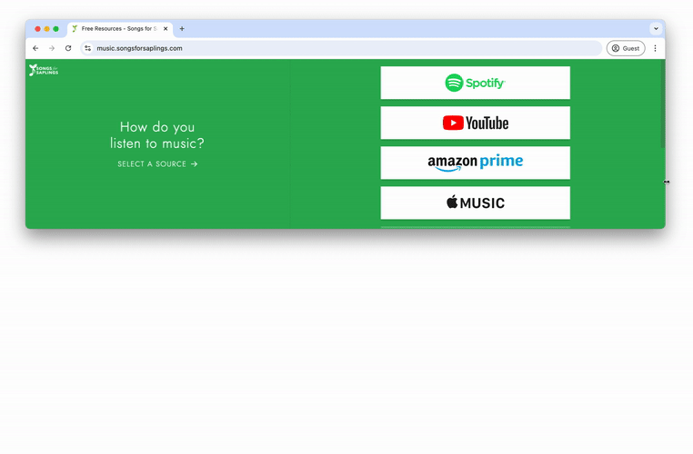
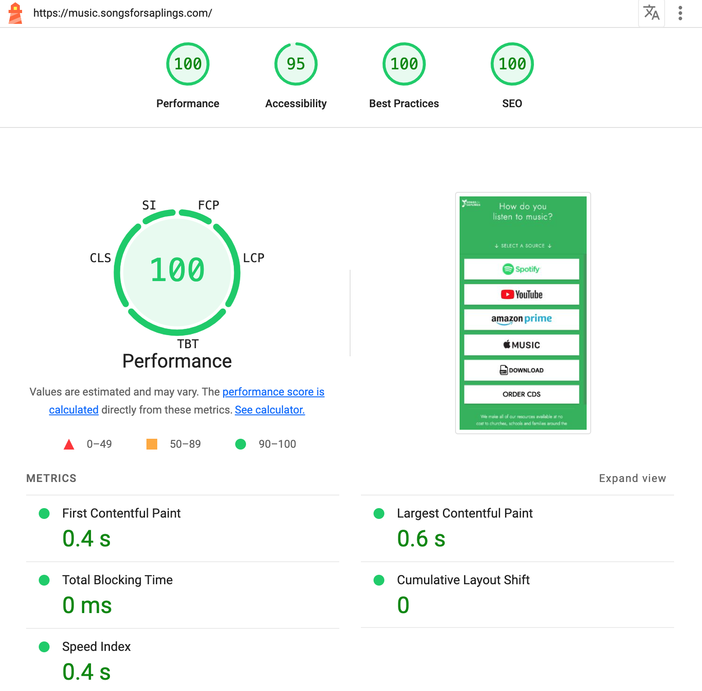

# music.songsforsplings.com: a Songs for Saplings Webapp

[music.songsforsplings.com](music.songsforsplings.com) is an open-source webapp created to get Songs for Saplings music to the world.

**Browsing**: Quickly find music on any platform, in any language, on any device.

**Partner Percs**: Our church partners easily embed the app in their own website, giving their members exclusive access content and resources for free.

**Any Device**: The app is fully responsive, supporting all devices, including tiny embedds.

**Performance**: The app is fast, with a 100% Lighthouse performance score.

## What is music.songsforsplings.com?

Most artists have relatively simple discographies. However, when content comes in several languages, in several albums, available through several channels, and distributes it through many partners, it becomes difficult for audiences from all over the world to find the content they are looking for. To solve this problem, Songs for Saplings now offers an iframe-embeddable, cloud-hosted web app for navigating their discography.

The stack has a React/NextJS frontend deployed to DigitalOcean Droplet. To allow non-technical people to manage the discography efficiently, an integrated Google sheet defines the content that the app will display. Opt-in cookies, Mixpanel integration, and automated mailing integrate the app with the rest of the Songs for Saplings ecosystem.

With music.songsforspalings.com, listeners can access the content they want quickly and easily. Songs for Saplings can distribute the content they want to new listeners more easily.Finally, Songs for Saplings can now manage their discography and other content all from one place.

This webapp is primarily intended as an iframe-embeddable widget to be easily added to people's sites. However, it is also a standalone site: [music.songsforsaplings.com](https://music.songsforsaplings.com).

## How to run the app

### Setup

1. Clone the repository to your local machine.
2. Install the necessary dependencies by running `npm install` in the root directory.
3. To start the development server, running `npm run dev` in the root directory.

### Deployment

After pushing changes to `main`, you can deploy to production by entering the command `npm run deploy` on your local machine.

### Credits

Created by the Songs for Saplings team.

Developed by Daniel Dirksen.

© Songs for Saplings 2024. All rights reserved.
